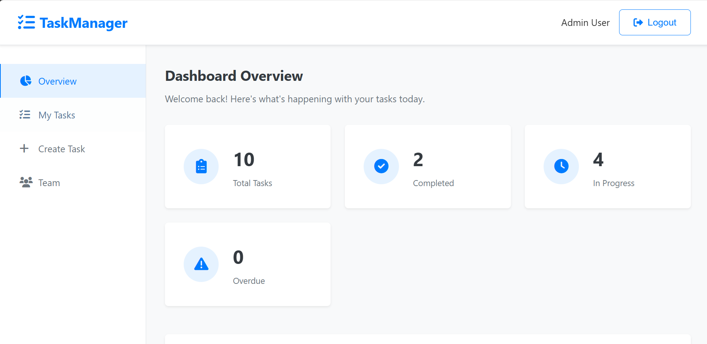

# 🚀 TaskMaster Pro - The Ultimate Task Management Experience

> *"Because life's too short for boring task managers!"* 



Welcome to **TaskMaster Pro** - where productivity meets fun! 🎉 This isn't just another task management app; it's your personal productivity superhero that makes managing tasks feel like a game!

## 🎯 What Makes This Special?

- **🌊 Real-time Magic**: Watch tasks update instantly across all devices (Socket.IO wizardry!)
- **🎮 Secret Features**: Hidden keyboard shortcuts and Easter eggs for the curious
- **🎨 Beautiful UI**: Smooth animations and delightful interactions
- **⚡ Lightning Fast**: Built with performance in mind
- **🔐 Fort Knox Security**: JWT authentication + bcrypt hashing
- **📱 Mobile Ready**: Looks amazing on any device

## ✨ Cool Features That'll Make You Smile

### 🎹 Keyboard Ninja Mode
- `Ctrl + N` → Create new task instantly
- `Ctrl + /` → Show all shortcuts
- `Escape` → Close any modal
- **Secret**: Click the logo 7 times for a surprise! 🎊
- **Ultra Secret**: Try the Konami code (↑↑↓↓←→←→BA) 🎮

### 🚀 Quick Progress Powers
Click those colorful progress buttons on any task:
- **25%** → "Getting started!"
- **50%** → "Halfway there!"  
- **75%** → "Almost done!"
- **✅** → "Victory dance time!"

### 🎭 Fun Interactions
- Hover animations that respond to your every move
- Satisfying button clicks with subtle feedback
- Confetti celebration when you discover secrets
- Loading spinners with rainbow effects

## 🛠️ Tech Stack (The Dream Team)

- **🏗️ Backend**: Node.js + Express.js (The reliable duo)
- **📦 Database**: MongoDB + Mongoose (Data storage that scales)
- **⚡ Real-time**: Socket.IO (Instant updates like magic)
- **🔐 Security**: JWT + bcrypt (Your data's bodyguard)
- **🎨 Frontend**: Vanilla JS + CSS3 (Pure, fast, beautiful)

## � Quick Start (3 Easy Steps!)

1. **Clone & Install**
```bash
git clone https://github.com/your-username/TaskMaster-Pro.git
cd TaskMaster-Pro
npm install
```

2. **Setup Environment**
```env
PORT=3000
MONGODB_URI=mongodb://localhost:27017/taskmaster
JWT_SECRET=your-super-secret-key
```

3. **Launch & Enjoy**
```bash
npm run seed    # Load awesome sample data
npm run dev     # Start the magic! ✨
```

Visit `http://localhost:3000` and prepare to be amazed! 🎊

## 🎮 Test Drive with Sample Data

We've included a **super cool demo database** with:
- 👥 **4 Diverse Users** (Admin, Developers, QA)
- 📝 **10 Realistic Tasks** (From design to deployment)
- 🎯 **Various Progress States** (0% to 100%)
- 🏷️ **Colorful Tags & Priorities**

**Test Accounts:**
- **Admin**: admin@example.com / admin123
- **Developer**: john@example.com / password123
- **Manager**: jane@example.com / password123
- **QA**: mike@example.com / password123

## 🎨 Screenshots & Demo


*The main dashboard showing real-time task updates and progress tracking*

## � API Endpoints (For the Developers)

### Authentication Magic
```bash
POST /api/auth/register  # Join the family
POST /api/auth/login     # Welcome back!
GET  /api/auth/me        # Who am I?
```

### Task Superpowers
```bash
GET    /api/tasks        # Show me everything
POST   /api/tasks        # Create something awesome  
PUT    /api/tasks/:id    # Make it better
DELETE /api/tasks/:id    # Sometimes we must let go
```

### User Management
```bash
GET /api/users           # Meet the team
GET /api/users/:id       # User spotlight
PUT /api/users/:id       # Level up profile
```

## � Real-time Events (Live Updates!)

- `task:created` → "New task alert! 🆕"
- `task:updated` → "Something changed! ⚡"  
- `task:completed` → "Victory achieved! 🎉"
- `user:online` → "Friend joined! 👋"

## 🎯 Project Structure (Organized Chaos)

```
TaskMaster-Pro/
├── 📁 config/           # App configuration
├── 📁 controllers/      # Business logic heroes
├── 📁 models/          # Data structure stars
├── 📁 middleware/      # The guardians
├── 📁 routes/          # Traffic directors
├── 📁 public/          # Frontend magic
├── 📁 assets/          # Pretty pictures
├── 🌱 seed.js          # Sample data generator
└── 🚀 server.js        # The command center
```

## 🎊 Fun Facts

- **Lines of Code**: ~1,000+ lines of pure awesomeness
- **Hidden Features**: 3+ Easter eggs waiting to be discovered
- **Animation Count**: 10+ delightful micro-interactions
- **Coffee Consumed**: Probably too much ☕

## 🤝 Contributing

Found a bug? Have a cool idea? Want to add more Easter eggs? 

1. Fork it! 🍴
2. Create your feature branch 🌿
3. Commit your changes 💾
4. Push to the branch 🚀
5. Open a Pull Request 📬

## 📄 License

MIT License - Because sharing is caring! ❤️

---

## 🎯 What's Next?

- 📊 Analytics Dashboard
- 📱 Mobile App
- 🤖 AI Task Suggestions
- 🎵 Background Music Player
- 🏆 Achievement System

---

<div align="center">

**Built with ❤️, ☕, and a lot of 🎵**

*If this project made you smile, give it a ⭐!*

[Live Demo](http://localhost:3000) | [Report Bug](issues) | [Request Feature](issues)

</div>

---

> *"The best task manager is the one you actually want to use!"* - TaskMaster Pro Philosophy 🚀
